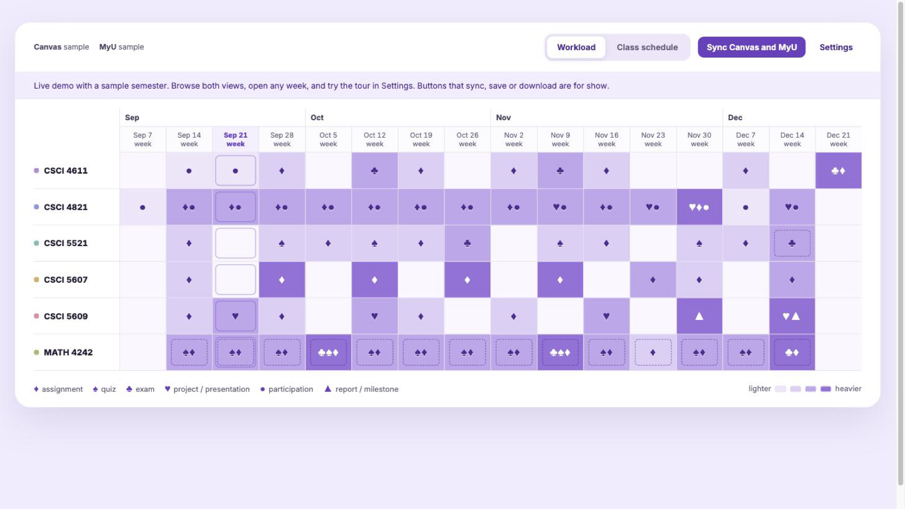
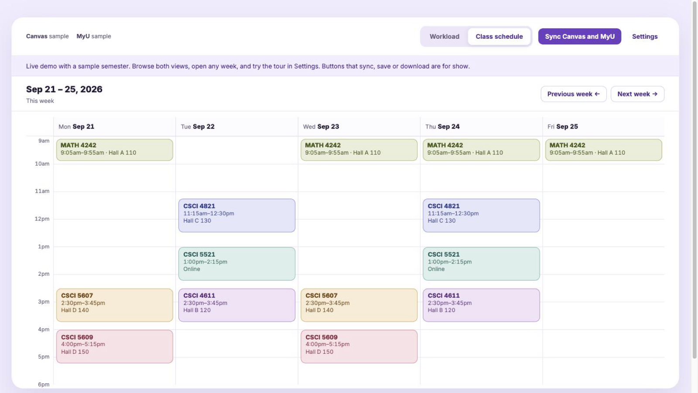
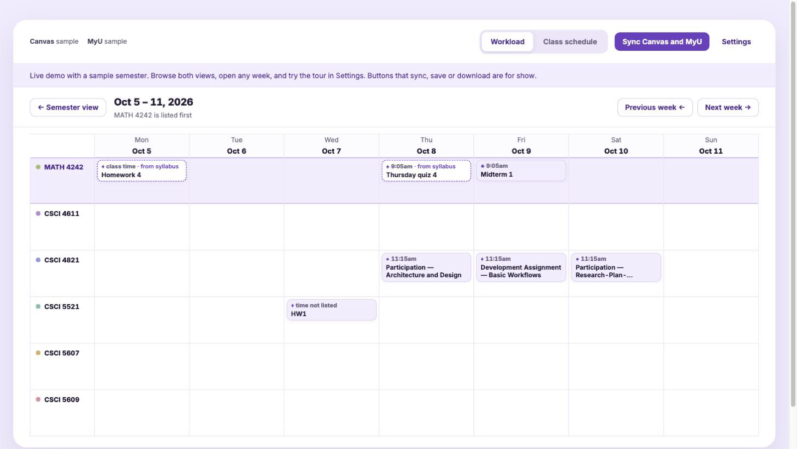

<div align="center">

<a href="https://kenny2077.github.io/Gopher-Calendar/"></a>

# Gopher Calendar

**Your whole semester on one page: Canvas deadlines and MyU classes, synced from the tabs you're already logged into.**

[](https://kenny2077.github.io/Gopher-Calendar/)
[](https://github.com/kenny2077/Gopher-Calendar/actions/workflows/ci.yml)
[](extension/manifest.json)
[](SECURITY.md)
[](LICENSE)

**[Live demo](https://kenny2077.github.io/Gopher-Calendar/)** ·
[Quick install](#quick-install) ·
[How it works](#how-it-works) ·
[Privacy](#privacy-and-ai) ·
[Contributing](CONTRIBUTING.md)

</div>

---

Students at the University of Minnesota have two calendars. **MyU** says where you need to be, and
**Canvas** says what you need to do. Gopher Calendar puts both on one page, and it also reads the
syllabus for the dates Canvas never got.

- **Which weeks will crush you**: every course against every week. Darker purple means more is
  due, and card-suit marks show what kind (♣ exam, ♠ quiz, ♦ assignment, ♥ project).
- **Where to be today**: your MyU class schedule on a week grid that fits one screen. University
  holidays are already taken out.
- **What Canvas is missing**: many professors put dates only in a syllabus PDF or the course Home
  page. The calendar finds those files and reads them only after you say yes. New dates show dashed
  until you confirm them.
- **Repeating events**: a line like "each lab, except the first week, begins with a short quiz"
  becomes Quiz 1, 2, 3… on each lab day.
- **Nothing to set up**: no account, no server, no password. It reads, and never writes, using the
  sessions already open in your browser.
- **Take it anywhere**: export a `.ics` file for Google Calendar, Apple Calendar or Outlook.

## Quick install

Gopher Calendar isn't on the Chrome Web Store yet. Load it from source:

```bash
git clone https://github.com/kenny2077/Gopher-Calendar.git
```

1. Open `chrome://extensions` and turn on **Developer mode** (top right).
2. Click **Load unpacked** and pick the `extension/` folder.
3. Log in to [Canvas](https://canvas.umn.edu) and [MyU](https://www.myu.umn.edu) in the same Chrome profile.
4. Click the Gopher Calendar icon, then **Sync and open calendar**.

Want to look first? The **[live demo](https://kenny2077.github.io/Gopher-Calendar/)** runs the same
page with a sample semester. The buttons there are for show.

## Getting started

| Step | What you do | What happens |
|---|---|---|
| Sync | Click **Sync Canvas and MyU** | Deadlines from Canvas, classes from MyU, holidays from the UMN calendar. Takes about 30 seconds. |
| Approve sources | Check what's listed in **Sources to read**, then click **Read** | The syllabus and schedule files it found are read, and missing dates are filled in. |
| Confirm | Click a dashed item, or **Confirm all** | The date is marked as checked by you. |
| Explore | Click any week in the grid | That week's items, with the course you clicked listed first. |
| Export | **Settings → Download .ics file** | One file with every class meeting and deadline. |

A three-step tour opens the first time the calendar has data. **Settings → Show the tour** replays it.

<table>
<tr>
<td width="50%"></td>
<td width="50%"></td>
</tr>
<tr>
<td align="center"><b>Class schedule</b>: from MyU, holidays removed</td>
<td align="center"><b>Week view</b>: dashed items came from the syllabus</td>
</tr>
</table>

## How it works

1. **Read what the university already publishes.** Canvas's API gives due dates, points and whether
   you submitted. MyU gives your class times and rooms. UMN's public academic calendar gives holidays.
   This builds the calendar with plain code: no AI and no guessing.
2. **Find what Canvas is missing.** The extension looks at each course's Syllabus tab, Home page,
   files, pages and modules. It judges them by name ("syllabus", "schedule", "calendar") and by how
   many dates a page mentions, then picks at most three per course and drops duplicate copies. At this
   point only names are looked at. Nothing is downloaded.
3. **Read only what you approve.** After you click **Read**, rules on your computer find lines like
   "HW 3 due Monday 9/28 at the beginning of the class", table rows like
   "Mon Dec 14 | FP4 slides due 11:59am", and weekly rules. Found dates are matched to the Canvas
   assignments that had none, and anything Canvas already has is skipped.

Approvals are remembered. You're asked again only when a file changes or a new one appears.
Something outside Canvas, like a course website or a GitHub page, gets a link and three short steps:
open it, save it as a PDF, then **Add a file**.

<details>
<summary><b>What sync requests, exactly</b></summary>

Every request is a `GET`, sent one at a time with a pause, from inside a Canvas or MyU tab so it
carries your existing session.

| Source | What | Endpoint |
|---|---|---|
| Canvas | courses, current term, syllabus | `GET /api/v1/courses?include[]=term&include[]=syllabus_body` |
| Canvas | deadlines with status | `GET /api/v1/planner/items` |
| Canvas | assignments with no due date | `GET /api/v1/courses/:id/assignments` |
| Canvas | candidate sources (names only) | `…/files`, `…/pages`, `…/modules`, `…/front_page` |
| MyU | one week of meetings | `IScript_DrawSection?section=UM_SSS_ACAD_SCHEDULE&effdt=…` |
| MyU | meeting pattern and dates | `IScript_DrawSection?section=UM_SSS_CLASS_DETAIL&…` |
| UMN (public) | closures and no-class days | `https://academic-calendar.umn.edu/academic_calendar` |

Quirks it handles (all covered by tests): Canvas's `while(1);` JSON prefix and UTC times
(an 11:59pm deadline arrives as 04:59 the next day), MyU day numbers that overflow the month
(`20260931`), classes with several meeting rows, and MyU listing classes on university holidays.

</details>

## Privacy and AI

AI is **optional and off by default**.

| | On this device (default) | With an AI model (optional) |
|---|---|---|
| Who reads approved files | Rules in [`extension/lib/extract.js`](extension/lib/extract.js) | Anthropic, OpenAI or Azure OpenAI, with **your own key** |
| What leaves your browser | Nothing | File names while picking sources, then the text of the files you approved, the course code and Canvas item titles. Never your name, grades or submissions. |
| API key | Not needed | Stored only in this browser; Chrome asks before the extension may contact the provider |
| Good at | Dates written in the text, tables, clear weekly quiz rules | Unusual wording, repeating events described in prose, scanned PDFs |

In AI mode the model only *describes* repeating events (name, weekday, first and last date).
Code turns that into dates, skips holidays, and checks every answer: only real items, only dates
inside the term. Supported providers:

| Provider | Default model | Output |
|---|---|---|
| Anthropic | `claude-sonnet-5` | Structured output (JSON schema) |
| OpenAI | `gpt-6-luna` | Strict structured output (JSON schema) |
| Azure OpenAI | your deployment | Strict structured output (JSON schema) |

On the maintainer's six Fall 2026 courses, the on-device rules found all 30 dates the AI found, with
no false ones. That's a small sample, and the rules were tuned on it. See [SECURITY.md](SECURITY.md)
for permissions and how to report a problem.

## Project layout

```
extension/
  manifest.json, background.js   sync orchestration (read-only, one request at a time)
  lib/canvas-collect.js          runs inside canvas.umn.edu
  lib/myu-collect.js             runs inside www.myu.umn.edu
  lib/normalize.js, model.js     raw data → deadlines, classes, weeks, workload
  lib/sources.js                 which syllabus/schedule sources to read; approvals; duplicates
  lib/extract.js                 on-device reader, plus weekly-series expansion
  lib/polish.js                  optional AI reader (Anthropic / OpenAI / Azure); PDF text via pdf.js
  lib/closures.js, ics.js        UMN holidays; calendar export
  dashboard/, popup/             the calendar page and toolbar popup
demo/                            GitHub Pages demo (same page, sample semester, inert buttons)
test/                            node --test suites with synthetic fixtures
dev/                             local preview server and tools
```

## Development

```bash
npm install
npm test             # all suites
npm run preview      # http://localhost:5178/dev/preview.html with a sample semester
npm run build:demo   # builds the Pages demo into _site/
```

See [CONTRIBUTING.md](CONTRIBUTING.md) for the ground rules. In short: read-only requests, no
real student data in the repo, and a test for every new syllabus pattern.

## Roadmap

- "What changed since last sync"
- Study-time suggestions in the gaps between classes
- Chrome Web Store release
- Direct Google Calendar sync

## Credits

The workload grid comes from [Awesome Calendar Skill](https://github.com/kenny2077/Awesome-calendar-skill).
[Gopher Grades](https://github.com/samyok/gophergrades) showed that MyU's schedule pages can be
read from an extension, and Better Canvas did the same for Canvas's API. No code is copied from
either. Gopher Calendar isn't affiliated with or endorsed by the University of Minnesota.

## License

[MIT](LICENSE). pdf.js is Apache-2.0 and Inter is SIL OFL 1.1; their license files ship next to them.
